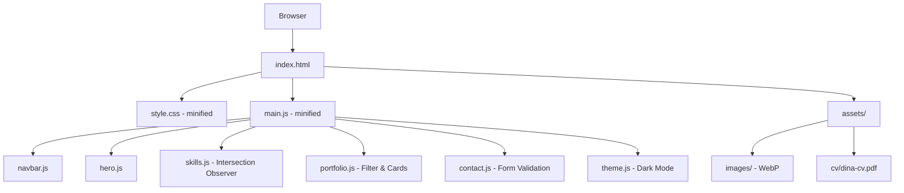
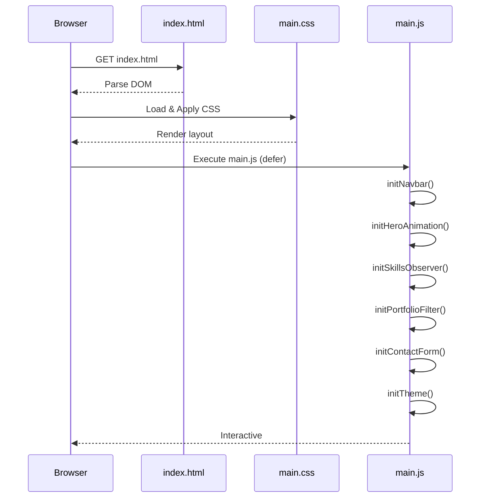

# Dokumen Desain: Portfolio Profile — Dina Kartika P.

## Overview

Dokumen ini menjelaskan desain teknis untuk portofolio web pribadi Dina Kartika P. Produk akhir adalah sebuah *single-page application* (SPA) berbasis HTML, CSS, dan JavaScript vanilla yang dapat dihosting secara statis (misalnya GitHub Pages, Netlify, atau Vercel) tanpa memerlukan server back-end.

### Tujuan Teknis

- Tampilan profesional, modern, dan responsif di rentang lebar layar 320 px–1920 px.
- Performa tinggi: LCP < 3 detik, skor Lighthouse ≥ 90 pada kategori Performa, Aksesibilitas, dan SEO.
- Aksesibilitas penuh: WCAG 2.1 Level AA, navigasi keyboard, kontras warna ≥ 4,5:1.
- Dukungan dark mode otomatis melalui `prefers-color-scheme`.
- Tidak ada dependensi framework JavaScript berat; semua animasi dan interaksi ditulis menggunakan CSS Transitions/Animations dan Web APIs standar.

### Pendekatan Teknis

| Aspek | Keputusan | Alasan |
|---|---|---|
| Bahasa | HTML5 + CSS3 + JavaScript ES6+ | Tidak perlu build pipeline kompleks; ringan dan cepat |
| Build Tool | Vite (mode static) | Minifikasi otomatis, HMR saat pengembangan, zero-config |
| CSS | CSS Custom Properties + BEM naming | Mudah di-maintain, mendukung dark mode via `:root` |
| Animasi | CSS Animations + Intersection Observer API | Performa lebih baik dibanding JS animation loop |
| Form | HTML5 Constraint Validation + JS custom messages | Tidak perlu library eksternal |
| Gambar | Format WebP, `<picture>` fallback JPEG/PNG | Ukuran file 50% lebih kecil |
| Deployment | GitHub Pages / Netlify (static hosting) | Gratis, CDN global, CI/CD otomatis |

---

## Architecture

### Gambaran Umum

Aplikasi ini adalah *Single-Page Application* berbasis file statis. Tidak ada back-end, tidak ada database, dan tidak ada API call (form kontak menggunakan layanan pihak ketiga seperti Formspree atau mailto).



### Struktur Direktori

```
Portofolio-Dina-Kartika-P/
├── index.html
├── package.json          # Vite config
├── vite.config.js
├── src/
│   ├── css/
│   │   ├── main.css      # Entry point CSS
│   │   ├── variables.css # CSS Custom Properties
│   │   ├── reset.css     # CSS Reset / Normalize
│   │   ├── navbar.css
│   │   ├── hero.css
│   │   ├── about.css
│   │   ├── skills.css
│   │   ├── portfolio.css
│   │   ├── contact.css
│   │   ├── footer.css
│   │   └── utilities.css
│   ├── js/
│   │   ├── main.js       # Entry point JS
│   │   ├── navbar.js     # Sticky, active highlight, hamburger
│   │   ├── hero.js       # Entrance animation trigger
│   │   ├── skills.js     # Scroll-triggered progress bar animation
│   │   ├── portfolio.js  # Filter tabs & card rendering
│   │   ├── contact.js    # Form validation
│   │   └── theme.js      # Dark mode detection & toggle
│   └── assets/
│       ├── images/
│       │   ├── profile.webp
│       │   └── projects/
│       │       └── [project-slug].webp
│       └── cv/
│           └── dina-cv.pdf
├── public/               # Static assets (favicon, robots.txt, sitemap.xml)
└── dist/                 # Output build (dihasilkan oleh Vite)
```

### Alur Render Awal



---

## Components and Interfaces

### 1. Navbar (`navbar.js`)

**Tanggung Jawab:**
- Render sticky navbar yang selalu terlihat di atas layar.
- Smooth scroll ke seksi yang dituju saat tautan diklik (durasi ≤ 800 ms).
- Highlight tautan aktif menggunakan `IntersectionObserver` (threshold 50% dari atas viewport).
- Toggle menu hamburger pada lebar < 768 px; menu tertutup otomatis setelah tautan diklik.

**Antarmuka Fungsi:**
```javascript
/**
 * Menginisialisasi seluruh perilaku navbar.
 * Dipanggil sekali saat DOMContentLoaded.
 */
function initNavbar(): void

/**
 * Menggulir halaman ke elemen target secara mulus.
 * @param {string} targetId - ID elemen seksi tujuan
 * @param {number} [duration=600] - Durasi animasi scroll dalam ms
 */
function smoothScrollTo(targetId: string, duration?: number): void

/**
 * Memperbarui kelas aktif pada tautan navbar.
 * @param {string} activeSectionId - ID seksi yang sedang aktif
 */
function setActiveNavLink(activeSectionId: string): void

/**
 * Membuka atau menutup panel menu mobile.
 * @param {boolean} isOpen - Status panel yang diinginkan
 */
function toggleMobileMenu(isOpen: boolean): void
```

### 2. Hero Section (`hero.js`)

**Tanggung Jawab:**
- Memicu animasi masuk (*entrance animation*) pada semua elemen Hero saat halaman pertama kali dimuat.
- Total durasi animasi ≤ 1,5 detik dengan *stagger* antar elemen.

**Antarmuka Fungsi:**
```javascript
/**
 * Memicu animasi masuk pada elemen-elemen Hero Section.
 * Dipanggil sekali setelah DOM siap.
 */
function initHeroAnimation(): void
```

**Urutan Animasi (Stagger):**

| Elemen | Delay | Durasi |
|---|---|---|
| Foto profil | 0 ms | 600 ms |
| Nama (`<h1>`) | 200 ms | 400 ms |
| Tagline | 400 ms | 400 ms |
| Deskripsi singkat | 600 ms | 400 ms |
| Tombol CTA | 800 ms | 400 ms |

Total: 800 + 400 = 1200 ms < 1500 ms ✓

### 3. Skills Section (`skills.js`)

**Tanggung Jawab:**
- Menggunakan `IntersectionObserver` untuk mendeteksi kapan Skills_Section memasuki viewport.
- Menjalankan animasi pengisian progress bar dari 0% ke nilai target saat pertama kali terlihat.
- Animasi hanya berjalan satu kali per sesi halaman.

**Antarmuka Fungsi:**
```javascript
/**
 * Menginisialisasi observer untuk animasi progress bar.
 */
function initSkillsObserver(): void

/**
 * Menganimasikan sebuah progress bar dari 0 ke nilai target.
 * @param {HTMLElement} bar - Elemen progress bar
 * @param {number} targetPercent - Nilai target (0–100)
 * @param {number} [duration=1000] - Durasi animasi dalam ms
 */
function animateProgressBar(bar: HTMLElement, targetPercent: number, duration?: number): void
```

### 4. Portfolio Section (`portfolio.js`)

**Tanggung Jawab:**
- Merender daftar `Kartu_Proyek` dari data JavaScript.
- Menerapkan filter berdasarkan kategori proyek dengan animasi transisi ≤ 400 ms.
- Tampilan grid: ≥ 2 kolom pada lebar ≥ 768 px, 1 kolom pada lebar < 768 px.

**Antarmuka Fungsi:**
```javascript
/**
 * Menginisialisasi filter dan render kartu proyek.
 * @param {Project[]} projects - Array data proyek
 */
function initPortfolioFilter(projects: Project[]): void

/**
 * Memfilter dan merender ulang kartu berdasarkan kategori.
 * @param {string} category - Kategori filter; "all" untuk semua
 */
function filterProjects(category: string): void

/**
 * Membuat elemen HTML Kartu_Proyek dari data proyek.
 * @param {Project} project - Objek data proyek
 * @returns {HTMLElement} - Elemen kartu yang siap dirender
 */
function createProjectCard(project: Project): HTMLElement
```

### 5. Contact Section (`contact.js`)

**Tanggung Jawab:**
- Validasi sisi klien untuk semua kolom formulir sebelum pengiriman.
- Menampilkan pesan error per kolom tanpa me-refresh halaman.
- Menampilkan notifikasi sukses dalam < 2 detik setelah pengiriman berhasil.

**Antarmuka Fungsi:**
```javascript
/**
 * Menginisialisasi event listener formulir kontak.
 */
function initContactForm(): void

/**
 * Memvalidasi seluruh isian formulir kontak.
 * @param {ContactFormData} data - Data formulir
 * @returns {ValidationResult} - Objek berisi status valid dan map error per field
 */
function validateContactForm(data: ContactFormData): ValidationResult

/**
 * Memvalidasi format alamat email.
 * @param {string} email - String email yang akan divalidasi
 * @returns {boolean} - true jika format valid
 */
function isValidEmail(email: string): boolean
```

### 6. Theme Module (`theme.js`)

**Tanggung Jawab:**
- Mendeteksi `prefers-color-scheme: dark` saat halaman dimuat.
- Menerapkan class `.dark-mode` pada `<html>` untuk aktivasi CSS custom properties tema gelap.

**Antarmuka Fungsi:**
```javascript
/**
 * Menginisialisasi deteksi dan penerapan dark mode.
 */
function initTheme(): void
```

---

## Data Models

### Project (Data Proyek)

```typescript
interface Project {
  id: string;           // Slug unik, misalnya "ecommerce-dashboard"
  title: string;        // Judul proyek, maks 60 karakter
  description: string;  // Deskripsi singkat, maks 2 kalimat
  thumbnail: string;    // Path ke file gambar WebP, misalnya "/assets/images/projects/ecommerce-dashboard.webp"
  category: string;     // Kategori filter, misalnya "Web App", "Mobile", "Data"
  techStack: string[];  // Array tag teknologi, misalnya ["React", "Node.js", "PostgreSQL"]
  repoUrl?: string;     // URL repositori GitHub (opsional)
  demoUrl?: string;     // URL demo langsung (opsional)
}
```

### Skill (Data Keahlian)

```typescript
interface Skill {
  name: string;         // Nama teknologi/keahlian, misalnya "JavaScript"
  iconClass: string;    // Kelas ikon (Devicons atau FontAwesome), misalnya "devicon-javascript-plain"
  proficiency: number;  // Tingkat kemahiran 0–100
  category: "hard" | "soft";       // Jenis keahlian
  subCategory?: string; // Sub-kategori hard skill, misalnya "Languages", "Frameworks", "Tools"
}
```

### ContactFormData

```typescript
interface ContactFormData {
  fullName: string;   // Nama lengkap pengirim
  email: string;      // Alamat email
  subject: string;    // Subjek pesan
  message: string;    // Isi pesan
}
```

### ValidationResult

```typescript
interface ValidationResult {
  isValid: boolean;
  errors: {
    fullName?: string;
    email?: string;
    subject?: string;
    message?: string;
  };
}
```

### CSS Custom Properties (Skema Warna)

```css
:root {
  /* Warna Terang (Default) */
  --color-bg-primary:    #ffffff;
  --color-bg-secondary:  #f5f5f5;
  --color-text-primary:  #1a1a2e;
  --color-text-secondary:#4a4a6a;
  --color-accent:        #6c63ff;
  --color-accent-hover:  #574fd6;
  --color-border:        #e0e0e0;
  --color-card-bg:       #ffffff;
  --color-error:         #d32f2f;
  --color-success:       #388e3c;

  /* Tipografi */
  --font-family-heading: 'Poppins', sans-serif;
  --font-family-body:    'Inter', sans-serif;

  /* Spacing (Skala 4px) */
  --spacing-xs: 4px;
  --spacing-sm: 8px;
  --spacing-md: 16px;
  --spacing-lg: 24px;
  --spacing-xl: 40px;
  --spacing-2xl: 64px;

  /* Breakpoints (hanya dipakai di JS) */
  --bp-mobile: 768px;
  --bp-tablet: 1024px;
}

@media (prefers-color-scheme: dark) {
  :root {
    --color-bg-primary:    #0d0d1a;
    --color-bg-secondary:  #1a1a2e;
    --color-text-primary:  #e8e8f0;
    --color-text-secondary:#9090b0;
    --color-accent:        #8b85ff;
    --color-accent-hover:  #6c63ff;
    --color-border:        #2a2a4a;
    --color-card-bg:       #1a1a2e;
  }
}
```

### Breakpoints Responsif

| Nama | Nilai | Layout Utama |
|---|---|---|
| Mobile | < 768 px | 1 kolom, hamburger menu |
| Tablet | 768 px – 1023 px | 2 kolom, navbar penuh |
| Desktop | ≥ 1024 px | 3 kolom, layout maksimal |
| Wide | ≥ 1280 px | Max-width container 1280 px |

---

## Correctness Properties

*Sebuah properti adalah karakteristik atau perilaku yang harus berlaku pada semua eksekusi sistem yang valid — yakni, pernyataan formal tentang apa yang harus dilakukan sistem. Properti berfungsi sebagai jembatan antara spesifikasi yang dapat dibaca manusia dan jaminan kebenaran yang dapat diverifikasi mesin.*

### Penilaian Kelayakan PBT

Fitur ini adalah portofolio web statis. Sebagian besar antarmuka adalah rendering UI dan navigasi halaman. Namun, terdapat beberapa komponen logika murni yang sangat cocok untuk *property-based testing*:

- **Validasi formulir kontak** (`validateContactForm`, `isValidEmail`) — fungsi murni dengan domain input yang luas.
- **Filter proyek** (`filterProjects`) — logika murni yang memetakan array + string ke array yang lebih kecil.
- **Render kartu proyek** (`createProjectCard`) — fungsi deterministik yang memetakan data ke HTML.
- **Animasi progress bar** (`animateProgressBar`) — transformasi numerik dengan invariant yang dapat diverifikasi.

Komponen lain (rendering navbar, animasi hero, dark mode) bersifat UI murni dan tidak sesuai untuk PBT.


### Property 1: Active Nav Link Exclusivity

*Untuk setiap* ID seksi yang valid dalam dokumen, setelah `setActiveNavLink(sectionId)` dipanggil, tepat satu tautan navbar harus memiliki kelas aktif, dan tautan tersebut harus memiliki atribut `href` yang berisi ID seksi yang diberikan.

**Validates: Requirements 1.4**

### Property 2: Mobile Menu Toggle Round-Trip

*Untuk setiap* nilai boolean `isOpen`, setelah `toggleMobileMenu(isOpen)` dipanggil, panel menu mobile harus terlihat jika `isOpen` adalah `true`, dan tersembunyi jika `isOpen` adalah `false`. Memanggil `toggleMobileMenu(true)` lalu `toggleMobileMenu(false)` harus mengembalikan panel ke kondisi tersembunyi.

**Validates: Requirements 1.6**

### Property 3: Hero Animation Timing Invariant

*Untuk setiap* elemen dalam Hero Section, jumlah `animationDelay` dan `animationDuration` elemen tersebut tidak boleh melebihi 1500 milidetik.

**Validates: Requirements 2.8**

### Property 4: Progress Bar Animation Correctness

*Untuk setiap* nilai target dalam rentang [0, 100], fungsi `animateProgressBar` harus memulai animasi dari 0% dan berakhir tepat pada nilai target tersebut, sehingga lebar akhir progress bar (dalam persen) sama persis dengan nilai target yang diberikan.

**Validates: Requirements 4.3, 4.4**

### Property 5: Project Card Content Completeness

*Untuk setiap* objek `Project` yang valid, fungsi `createProjectCard` harus menghasilkan elemen HTML yang mengandung: judul proyek, deskripsi proyek, dan semua elemen dalam array `techStack`.

**Validates: Requirements 5.3**

### Property 6: Project Card Link Presence Conditional

*Untuk setiap* objek `Project`, jika `repoUrl` atau `demoUrl` adalah `undefined` atau tidak ada, maka elemen anchor yang sesuai tidak boleh ada dalam HTML yang dihasilkan oleh `createProjectCard`. Jika field tersebut didefinisikan, elemen anchor harus ada dan `href`-nya harus sama persis dengan nilai field tersebut.

**Validates: Requirements 5.4**

### Property 7: Filter Returns Only Matching Projects

*Untuk setiap* array proyek dan string kategori yang diberikan, `filterProjects(category)` harus mengembalikan tepat seluruh proyek yang memiliki `category` sama dengan filter (atau semua proyek jika filter adalah `"all"`). Tidak ada proyek yang lolos filter dengan kategori yang tidak cocok, dan tidak ada proyek yang cocok yang dikecualikan.

**Validates: Requirements 5.6, 5.7**

### Property 8: Form Validation Rejects Empty Fields

*Untuk setiap* objek `ContactFormData` di mana satu atau lebih field wajib (`fullName`, `email`, `subject`, `message`) kosong atau hanya berisi karakter whitespace, `validateContactForm` harus mengembalikan `isValid: false` dengan entri error untuk setiap field yang bermasalah.

**Validates: Requirements 6.3**

### Property 9: Email Validation Correctness

*Untuk setiap* string email yang tidak mengandung karakter `@`, atau tidak memiliki bagian domain yang valid setelah `@`, `isValidEmail` harus mengembalikan `false`. *Untuk setiap* string email yang mengandung tepat satu `@` dengan setidaknya satu karakter sebelumnya dan domain yang valid (berisi titik) setelahnya, `isValidEmail` harus mengembalikan `true`.

**Validates: Requirements 6.4**

### Property 10: External Links Security Attributes

*Untuk setiap* elemen anchor (`<a>`) dalam dokumen yang merujuk ke URL eksternal (dimulai dengan `http://` atau `https://` dan bukan domain halaman saat ini), atribut `target` harus bernilai `"_blank"` dan atribut `rel` harus mengandung kedua nilai `"noopener"` dan `"noreferrer"`.

**Validates: Requirements 6.7**

### Property 11: Image Alt Text Non-Empty

*Untuk setiap* elemen `` dalam dokumen, atribut `alt` tidak boleh berupa string kosong (`""`). Setiap gambar harus memiliki teks alternatif yang mendeskripsikan konten atau fungsinya.

**Validates: Requirements 7.3**

### Property 12: Color Contrast Ratio Compliance

*Untuk setiap* pasangan warna foreground dan background yang didefinisikan dalam CSS Custom Properties (baik mode terang maupun gelap), rasio kontras yang dihitung menggunakan formula WCAG 2.1 tidak boleh kurang dari 4,5:1.

**Validates: Requirements 7.4**

### Property 13: Below-the-Fold Images Have Lazy Loading

*Untuk setiap* elemen `` yang tidak termasuk dalam area tampilan awal halaman (bukan gambar LCP/hero), atribut `loading` harus bernilai `"lazy"`.

**Validates: Requirements 8.2**

---

## Error Handling

### Error Unduhan CV (Requirement 3.5)

```javascript
async function handleCVDownload(cvUrl: string): Promise<void> {
  try {
    const response = await fetch(cvUrl, { method: 'HEAD' });
    if (!response.ok) throw new Error('CV tidak tersedia');
    // Lanjutkan unduhan normal
    window.location.href = cvUrl;
  } catch (error) {
    // Nonaktifkan tombol dan tampilkan pesan error
    const cvButton = document.querySelector('.btn-download-cv') as HTMLButtonElement;
    cvButton.disabled = true;
    cvButton.setAttribute('aria-disabled', 'true');
    showErrorMessage('CV saat ini tidak tersedia. Silakan hubungi melalui formulir kontak.');
  }
}
```

**Strategi:** Pengecekan `HEAD` request dilakukan saat halaman dimuat. Jika gagal, tombol dinonaktifkan secara langsung tanpa menunggu klik pengguna.

### Error Validasi Formulir (Requirement 6.3, 6.4)

```
┌─────────────────────────────────────────────────────────┐
│                  Form Submit Event                       │
│                         │                               │
│              validateContactForm(data)                  │
│                         │                               │
│             ┌───────────┴──────────┐                    │
│        isValid: true          isValid: false            │
│             │                      │                    │
│    Submit to Formspree      Display inline errors       │
│             │               (per-field messages)        │
│    Show success toast        No page refresh            │
└─────────────────────────────────────────────────────────┘
```

**Pesan Error Per Field:**
- `fullName` kosong: "Nama lengkap wajib diisi."
- `email` kosong: "Alamat email wajib diisi."
- `email` format salah: "Format email tidak valid. Contoh: nama@domain.com"
- `subject` kosong: "Subjek pesan wajib diisi."
- `message` kosong: "Pesan tidak boleh kosong."

### Error Sumber Gambar

Semua elemen `` menyertakan atribut `onerror` yang mengganti gambar yang gagal dimuat dengan gambar placeholder SVG bawaan:

```html

```

### Error Tautan Eksternal

Semua tautan eksternal menggunakan `rel="noopener noreferrer"` untuk mencegah *tabnapping*. Tidak ada penanganan error tambahan yang diperlukan karena tautan dibuka di tab baru.

---

## Testing Strategy

### Pendekatan Dual Testing

Strategi pengujian menggunakan dua lapisan yang saling melengkapi:

1. **Unit Test / Example-Based Test** — Memverifikasi perilaku spesifik dengan contoh konkret.
2. **Property-Based Test (PBT)** — Memverifikasi properti universal yang berlaku untuk semua input valid.

PBT diterapkan karena fitur ini mengandung fungsi-fungsi murni (pure functions) dengan domain input yang besar: validasi email, filter proyek, rendering kartu, dan animasi progress bar.

### Library PBT

**[fast-check](https://fast-check.dev/)** (JavaScript/TypeScript) — dipilih karena:
- Terintegrasi langsung dengan Vitest (test runner yang digunakan bersama Vite).
- Mendukung arbitrary generators untuk string, number, array, dan object.
- Shrinking otomatis untuk memperkecil contoh yang gagal.

### Konfigurasi Test Runner

```javascript
// vite.config.js
import { defineConfig } from 'vite';

export default defineConfig({
  test: {
    environment: 'jsdom',  // Simulasi DOM browser
    globals: true,
    setupFiles: './src/tests/setup.js',
  }
});
```

```javascript
// Konfigurasi fast-check global
import * as fc from 'fast-check';
fc.configureGlobal({ numRuns: 100 });  // Minimal 100 iterasi per property test
```

### Struktur Direktori Test

```
src/
└── tests/
    ├── setup.js
    ├── unit/
    │   ├── navbar.test.js
    │   ├── hero.test.js
    │   ├── about.test.js
    │   ├── contact.test.js
    │   └── portfolio.test.js
    ├── property/
    │   ├── navbar.property.test.js   # Properties 1, 2
    │   ├── hero.property.test.js     # Property 3
    │   ├── skills.property.test.js   # Property 4
    │   ├── portfolio.property.test.js # Properties 5, 6, 7
    │   ├── contact.property.test.js  # Properties 8, 9
    │   └── accessibility.property.test.js # Properties 10, 11, 12, 13
    └── smoke/
        ├── css.smoke.test.js         # CSS media queries, sticky, transition
        └── build.smoke.test.js       # Minifikasi, WebP, skor Lighthouse
```

### Contoh Property Test

```javascript
// Feature: portfolio-profile, Property 7: Filter Returns Only Matching Projects
import * as fc from 'fast-check';
import { filterProjects } from '../../js/portfolio.js';

describe('Property 7: Filter Returns Only Matching Projects', () => {
  it('hanya mengembalikan proyek yang cocok dengan kategori yang dipilih', () => {
    // Feature: portfolio-profile, Property 7: filterProjects(category) returns exact subset
    fc.assert(
      fc.property(
        fc.array(
          fc.record({
            id: fc.string({ minLength: 1 }),
            title: fc.string({ minLength: 1 }),
            description: fc.string(),
            thumbnail: fc.string(),
            category: fc.constantFrom('Web App', 'Mobile', 'Data', 'UI/UX'),
            techStack: fc.array(fc.string({ minLength: 1 })),
          })
        ),
        fc.constantFrom('Web App', 'Mobile', 'Data', 'UI/UX', 'all'),
        (projects, category) => {
          const result = filterProjects(projects, category);
          if (category === 'all') {
            return result.length === projects.length;
          }
          return result.every(p => p.category === category) &&
                 result.length === projects.filter(p => p.category === category).length;
        }
      ),
      { numRuns: 100 }
    );
  });
});
```

```javascript
// Feature: portfolio-profile, Property 9: Email Validation Correctness
import * as fc from 'fast-check';
import { isValidEmail } from '../../js/contact.js';

describe('Property 9: Email Validation Correctness', () => {
  it('menolak string yang tidak mengandung @', () => {
    // Feature: portfolio-profile, Property 9: isValidEmail returns false without @
    fc.assert(
      fc.property(
        fc.string().filter(s => !s.includes('@')),
        (email) => isValidEmail(email) === false
      ),
      { numRuns: 100 }
    );
  });

  it('menerima email dengan format valid', () => {
    // Feature: portfolio-profile, Property 9: isValidEmail returns true for valid format
    fc.assert(
      fc.property(
        fc.emailAddress(),  // fast-check built-in email generator
        (email) => isValidEmail(email) === true
      ),
      { numRuns: 100 }
    );
  });
});
```

### Matriks Cakupan Pengujian

| Requirement | Jenis Test | Library | Properti |
|---|---|---|---|
| 1.2 Smooth scroll | Unit | Vitest + jsdom | — |
| 1.4 Active nav link | Property | fast-check | Property 1 |
| 1.6 Mobile menu toggle | Property | fast-check | Property 2 |
| 2.8 Animasi hero ≤ 1,5s | Property | fast-check | Property 3 |
| 4.3–4.4 Progress bar animasi | Property | fast-check | Property 4 |
| 5.3 Card content | Property | fast-check | Property 5 |
| 5.4 Card link conditional | Property | fast-check | Property 6 |
| 5.6–5.7 Filter proyek | Property | fast-check | Property 7 |
| 6.3 Validasi field kosong | Property | fast-check | Property 8 |
| 6.4 Validasi email | Property | fast-check | Property 9 |
| 6.7 Tautan eksternal | Property | fast-check | Property 10 |
| 7.3 Alt text gambar | Property | fast-check | Property 11 |
| 7.4 Rasio kontras | Property | fast-check | Property 12 |
| 8.2 Lazy loading | Property | fast-check | Property 13 |
| 3.5 CV error state | Unit | Vitest + jsdom | — |
| 6.2 Form sukses notif | Integration | Playwright | — |
| 7.1 Responsive layout | Integration | Playwright | — |
| 7.2 LCP < 3s | Smoke | Lighthouse CI | — |
| 8.4–8.6 Skor Lighthouse ≥ 90 | Smoke | Lighthouse CI | — |

### Panduan Tag Property Test

Setiap property-based test harus menyertakan komentar dengan format berikut tepat sebelum `fc.assert`:

```
// Feature: portfolio-profile, Property {N}: {deskripsi singkat properti}
```

Contoh: `// Feature: portfolio-profile, Property 7: filterProjects(category) returns exact subset`
